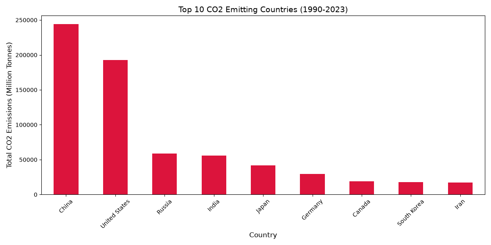
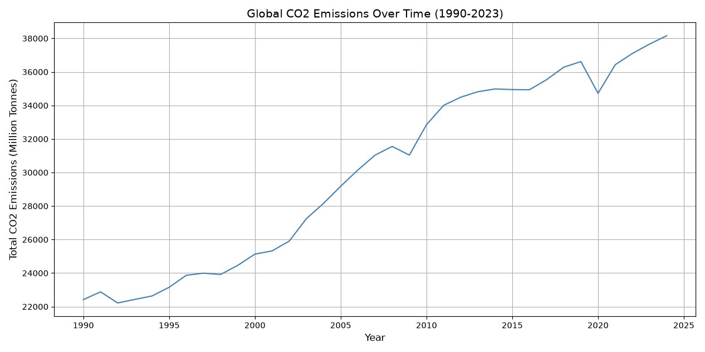
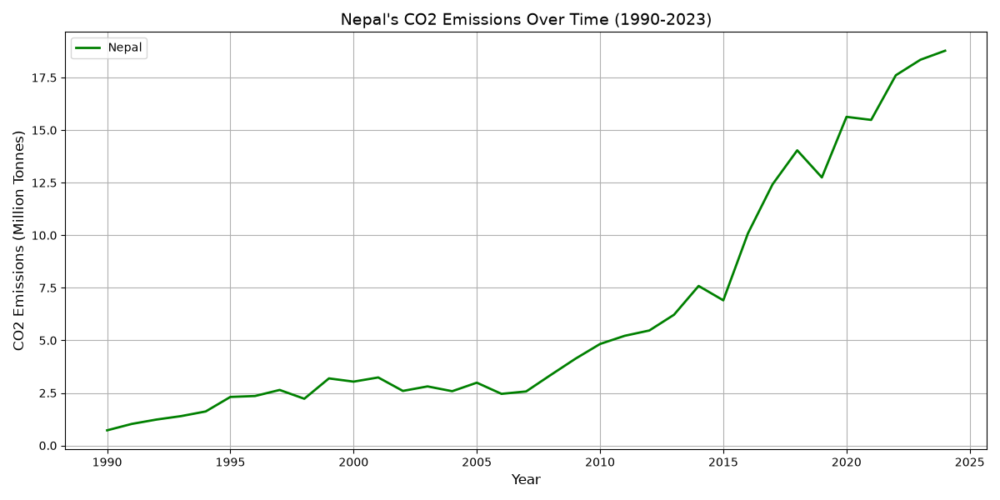
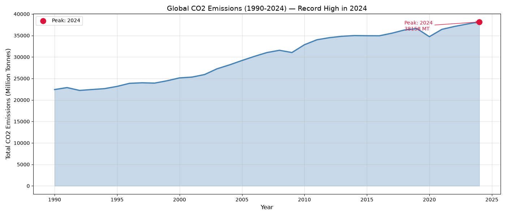
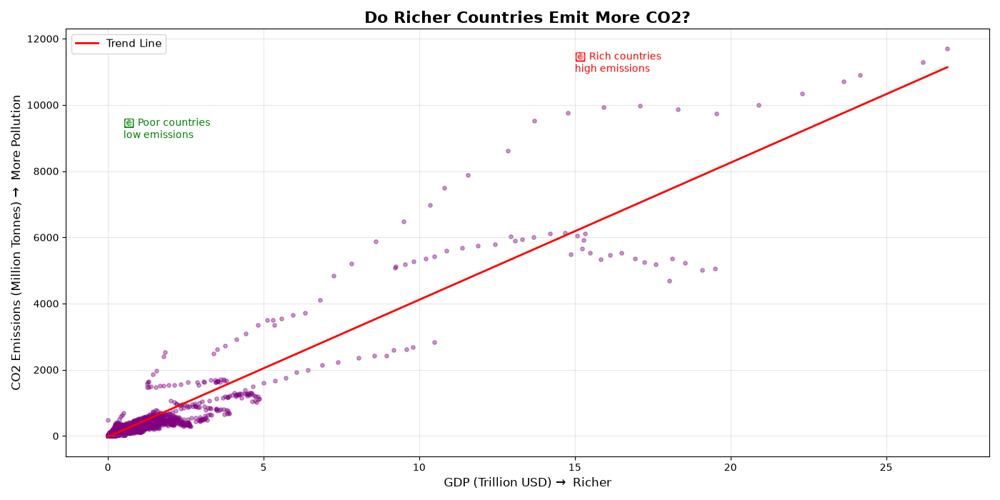

# 🌍 Global CO2 Emissions Analysis

Exploratory data analysis of global CO2 emissions and climate trends 
using Python, Pandas and Matplotlib.

---

## 📌 Project Overview

This project analyzes global CO2 emission patterns from 1990 to 2024 
using real-world data from Our World in Data. It explores which 
countries emit the most, how emissions have changed over time, 
Nepal's position globally, and the relationship between wealth and pollution.

---

## ❓ Questions Answered

| # | Question |
|---|---|
| 1 | Which countries emit the most CO2? |
| 2 | How have global emissions changed from 1990–2024? |
| 3 | How have Nepal's emissions changed over time? |
| 4 | Which year recorded the highest global emissions? |
| 5 | Do richer countries emit more CO2? |

---

## 📊 Key Findings

- 🇨🇳 **China** is the largest emitter — nearly **2x more than USA**
- 📈 Global CO2 emissions have risen **70% since 1990**
- 🔴 **2024 is the highest CO2 emission year in recorded history** — 38,158 Million Tonnes
- 🇳🇵 **Nepal's emissions tripled after 2015** due to rapid urbanization
- 💰 **Richer countries generally emit more** — strong positive correlation with GDP
- 😷 **2020 saw a sharp drop** due to COVID-19 global lockdowns

---

## 📈 Visualizations

### Top 10 CO2 Emitting Countries (1990–2024)

### Global CO2 Emissions Over Time

### Nepal's CO2 Emissions Over Time

### Peak Emission Year — 2024

### CO2 Emissions vs GDP

---

## 🛠️ Tech Stack

---

## 📁 Project Structure
## 📁 Project Structure

global-co2-analysis/
├── data/
│ └── data.csv
├── visuals/
│ ├── top10_countries.png
│ ├── global_trend.png
│ ├── nepal_trend.png
│ ├── peak_year.png
│ └── co2_vs_gdp.png
├── analysis.ipynb
└── README.md

---

## 📂 Data Source

- **Our World in Data** — CO2 and Greenhouse Gas Emissions
- Dataset: [owid-co2-data](https://github.com/owid/co2-data)

---

## 👤 Author

**Baibhav Ojha**
Data Science Student @ Tribhuwan University, Nepal 🇳🇵
[GitHub](https://github.com/baibhavojha2008-tech)

---

## 🔜 Next Project

**Climate Injustice: How Nepal Suffers the Most Despite Polluting the Least**
